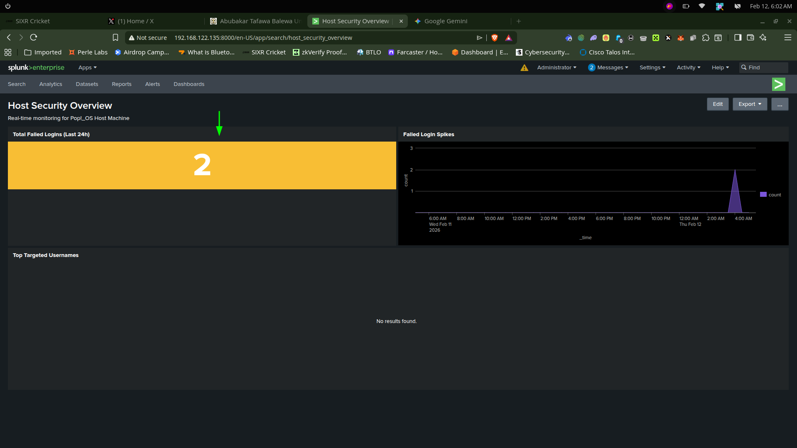

# Installation Guide

## Table of Contents
- [Step 1: Install KVM and Virtualization Tools](#step-1-install-kvm-and-virtualization-tools)
- [Step 2: Verify KVM Installation](#step-2-verify-kvm-installation)
- [Step 3: Download Ubuntu Server ISO](#step-3-download-ubuntu-server-iso)
- [Step 4: Create the Splunk Server VM in virt-manager](#step-4-create-the-splunk-server-vm-in-virt-manager)
- [Step 5: Install Ubuntu Server](#step-5-install-ubuntu-server)
- [Step 6: Initial Splunk Server Setup](#step-6-initial-splunk-server-setup)
- [Step 7: Install Splunk Enterprise](#step-7-install-splunk-enterprise)
- [Step 8: Access Splunk Web UI](#step-8-access-splunk-web-ui)
- [Step 9: Create and Configure Forwarder VMs](#step-9-create-and-configure-forwarder-vms)
- [Step 10: Basic Splunk Dashboard Setup](#step-10-basic-splunk-dashboard-setup)
- [8.3 Create Custom Dashboard via XML (Advanced)](#83-create-custom-dashboard-via-xml-advanced)
- [8.4 Refresh Splunk and View Dashboard](#84-refresh-splunk-and-view-dashboard)
- [8.5 Verify Data is Being Collected](#85-verify-data-is-being-collected)
- [Dashboard Best Practices](#dashboard-best-practices)

## Step 1: Install KVM and Virtualization Tools

Run these commands on your Linux host:

```bash
sudo apt update
sudo apt install -y qemu-kvm libvirt-daemon-system libvirt-clients bridge-utils virt-manager
sudo usermod -aG libvirt $USER
sudo usermod -aG kvm $USER
```

After adding your user to the groups, log out and log back in for group membership to take effect.

## Step 2: Verify KVM Installation

Confirm virtualization support and libvirt status:

```bash
lsmod | grep kvm
groups | grep -E 'libvirt|kvm'
sudo systemctl start libvirtd
sudo systemctl enable libvirtd
sudo systemctl status libvirtd
```

Optional checks:

```bash
virsh -c qemu:///system list --all
sudo virsh net-list --all
```

## Step 3: Download Ubuntu Server ISO

Create a directory for the ISO and download Ubuntu Server 22.04 LTS:

```bash
mkdir -p ~/VMs/ISOs
cd ~/VMs/ISOs
wget https://releases.ubuntu.com/22.04/ubuntu-22.04.5-live-server-amd64.iso
ls -lh ubuntu-22.04.5-live-server-amd64.iso
```

## Step 4: Create the Splunk Server VM in virt-manager

Launch the GUI:

```bash
virt-manager
```

In the virt-manager interface:

1. Click "Create a new virtual machine"
2. Select "Local install media (ISO image or CDROM)"
3. Click "Forward"
4. Click "Browse..." and then "Browse Local"
5. Navigate to `~/VMs/ISOs/` and select the Ubuntu Server ISO
6. Confirm it detects "Ubuntu 22.04"
7. Click "Forward"

### VM hardware recommendations

- Name: `Splunk-Server`
- Memory: `3072 MB` (3 GB)
- CPUs: `2`
- Storage: `40 GB`
- Network: default virtual network (`NAT`)

Check "Customize configuration before install" and click "Finish".

### Customize VM settings

Before starting the install:

- Firmware: `BIOS` (unless you need UEFI)
- CPU: enable "Copy host CPU configuration"
- CPU topology: `2` cores
- Network model: `virtio` for best performance

Click "Begin Installation".

## Step 5: Install Ubuntu Server

In the Ubuntu installer:

- Language: English
- Keyboard: select your layout
- Installation type: Ubuntu Server
- Network: DHCP default
- Proxy: leave blank
- Mirror: use default
- Storage: use entire disk

### User and SSH setup

- Your name: `soc-admin` or your preferred name
- Server name: `splunk-server`
- Username: `socadmin`
- Password: create a strong password and save it securely
- SSH Setup: install OpenSSH Server
- Featured snaps: skip

Wait for installation to complete, then reboot when prompted.

## Step 6: Initial Splunk Server Setup

After reboot, log in and update the system:

```bash
sudo apt update && sudo apt upgrade -y
sudo apt install -y net-tools curl wget vim
```

Check the VM IP address:

```bash
ip addr show
```

Or, if `net-tools` is installed:

```bash
ifconfig
```

Note the VM IP address (usually `192.168.122.x` on the default NAT network).

## Step 7: Install Splunk Enterprise

Download and install Splunk Enterprise:

```bash
wget -O splunk-9.1.2-2b6e6e66d8a6-linux-2.6-amd64.deb "https://download.splunk.com/products/splunk/releases/9.1.2/linux/splunk-9.1.2-2b6e6e66d8a6-linux-2.6-amd64.deb"
sudo dpkg -i splunk-9.1.2-2b6e6e66d8a6-linux-2.6-amd64.deb
```

Start Splunk and accept the license:

```bash
sudo /opt/splunk/bin/splunk start --accept-license --answer-yes --no-prompt
sudo /opt/splunk/bin/splunk enable boot-start
```

## Step 8: Access Splunk Web UI

From your host machine, open a browser to:

`http://<VM_IP>:8000`

Default initial credentials:

- Username: `admin`
- Password: `changeme`

> Change the default password immediately after first login.

## Step 9: Create and Configure Forwarder VMs

Repeat the VM creation process for each forwarder.

### Forwarder VM recommendations

- Name: `Forwarder-1`, `Forwarder-2`, etc.
- Memory: `2048 MB` (2 GB)
- CPUs: `1`
- Storage: `20 GB`
- Ubuntu Server 22.04 LTS

### After Ubuntu install on each forwarder

Update the system and install tools:

```bash
sudo apt update && sudo apt upgrade -y
sudo apt install -y curl wget vim
```

Download and install the Splunk Universal Forwarder:

```bash
wget -O splunkforwarder-9.1.2-2b6e6e66d8a6-linux-2.6-amd64.deb "https://download.splunk.com/products/universalforwarder/releases/9.1.2/linux/splunkforwarder-9.1.2-2b6e6e66d8a6-linux-2.6-amd64.deb"
sudo dpkg -i splunkforwarder-9.1.2-2b6e6e66d8a6-linux-2.6-amd64.deb
```

Configure the forwarder to send data to the indexer (replace `<INDEXER_IP>`):

```bash
sudo /opt/splunkforwarder/bin/splunk add forward-server <INDEXER_IP>:9997 -auth admin:changeme
sudo /opt/splunkforwarder/bin/splunk add monitor /var/log/syslog -auth admin:changeme
sudo /opt/splunkforwarder/bin/splunk add monitor /var/log/auth.log -auth admin:changeme
sudo /opt/splunkforwarder/bin/splunk start --accept-license --answer-yes --no-prompt
sudo /opt/splunkforwarder/bin/splunk enable boot-start
```

Verify the forwarder connection from the Splunk server by checking `Settings > Forwarder Management` in Splunk Web.

## Step 10: Basic Splunk Dashboard Setup

### Access the Splunk Web Interface

1. Open your browser
2. Go to `http://<SPLUNK_SERVER_IP>:8000`
3. Log in with your admin credentials

### Create a Security Overview Dashboard

Via GUI:

1. Click `Dashboards`
2. Click `Create New Dashboard`
3. Enter `Security Operations Overview`
4. Choose layout `Classic (2-column)`
5. Click `Create Dashboard`

### Add panels

**Panel 1: Forwarder Status**

Search:

```splunk
index=_internal group=queue name=tcpout_queue | stats count by host
```

Visualization: Column Chart

**Panel 2: Failed Login Attempts**

Search:

```splunk
index=main source=/var/log/auth.log "Failed password" | stats count by host
```

Visualization: Table

**Panel 3: Event Activity Timeline**

Search:

```splunk
index=main | timechart count by host
```

Visualization: Line Chart


## 8.3 Create Custom Dashboard via XML (Advanced)

**On Splunk Server, create dashboard XML:**
```bash
sudo vim /opt/splunk/etc/apps/search/local/data/ui/views/soc_dashboard.xml
```

**Paste this content:**
```xml
<?xml version="1.0" encoding="UTF-8"?>
<dashboard version="1.1">
  <label>SOC Security Dashboard</label>
  <description>Real-time security monitoring and threat detection</description>
  <refresh>30</refresh>
  
  <row>
    <panel>
      <title>Authentication Failures by Host</title>
      <single>
        <search>
          <query>index=main source=/var/log/auth.log "Failed password" | stats count</query>
          <earliest>-24h@h</earliest>
          <latest>now</latest>
          <refresh>5m</refresh>
        </search>
        <option name="drilldown">all</option>
      </single>
    </panel>
    
    <panel>
      <title>Connected Forwarders</title>
      <single>
        <search>
          <query>index=_internal group=queue name=tcpout_queue | stats count</query>
          <earliest>-1h</earliest>
          <latest>now</latest>
        </search>
      </single>
    </panel>
  </row>
  
  <row>
    <panel>
      <title>Failed Login Attempts (Last 24h)</title>
      <table>
        <search>
          <query>index=main source=/var/log/auth.log "Failed password" | stats count by host, user | sort - count</query>
          <earliest>-24h@h</earliest>
          <latest>now</latest>
        </search>
        <option name="wrap">true</option>
        <option name="count">20</option>
      </table>
    </panel>
  </row>
  
  <row>
    <panel>
      <title>Event Volume by Host</title>
      <chart>
        <search>
          <query>index=main | timechart count by host</query>
          <earliest>-7d@h</earliest>
          <latest>now</latest>
        </search>
        <option name="charting.chart">line</option>
        <option name="charting.axisTitleX.text">Time</option>
        <option name="charting.axisTitleY.text">Event Count</option>
      </chart>
    </panel>
  </row>
</dashboard>
```

**Save and exit (vim commands):**
```
Press ESC
Type :wq
Press ENTER
```

* 8.4 Refresh Splunk and View Dashboard

```bash
# Restart Splunk to load new dashboard
sudo /opt/splunk/bin/splunk restart

# Or just refresh in Web UI: Settings > General Settings > Restart Splunk
```

**Access your custom dashboard:**
```
1. Login to Splunk web (http://<IP>:8000)
2. Click "Dashboards"
3. Click "SOC Security Dashboard"
4. Monitor real-time security events!
```

* 8.5 Verify Data is Being Collected

Before dashboards display data, verify logs are being ingested:

```
1. Go to Splunk web interface
2. Click "Search & Reporting"
3. Run this query: index=* | stats count by host
4. Should return results from forwarders and server
5. If no data, check forwarder connectivity in Settings > Forwarder Management
```

* Dashboard Best Practices

- **Refresh Rate:** Set to 5-10 minutes for dashboards with heavy queries
- **Time Range:** Use appropriate ranges (-24h for daily analysis, -7d for trends)
- **Alerts:** Add alerts to high-risk panels (Settings > Searches, Reports and Alerts)
- **Permissions:** Share dashboards with SOC team (Sharing & Permissions)

* Example Dashboard

