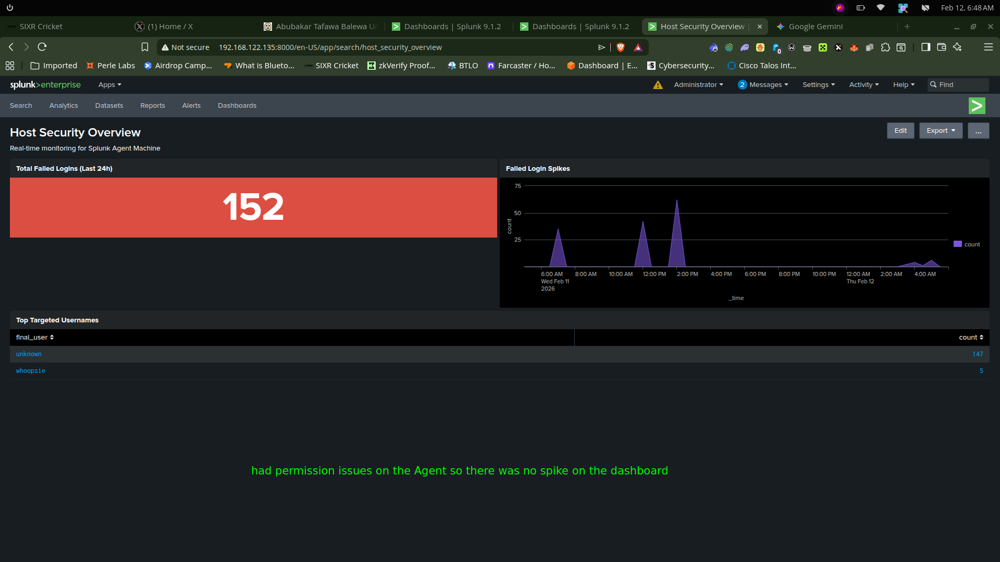
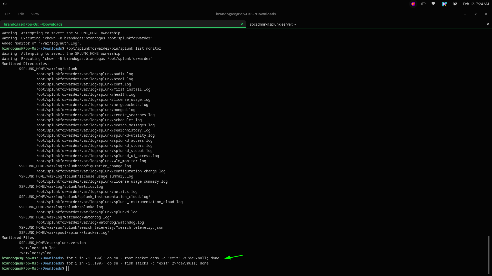
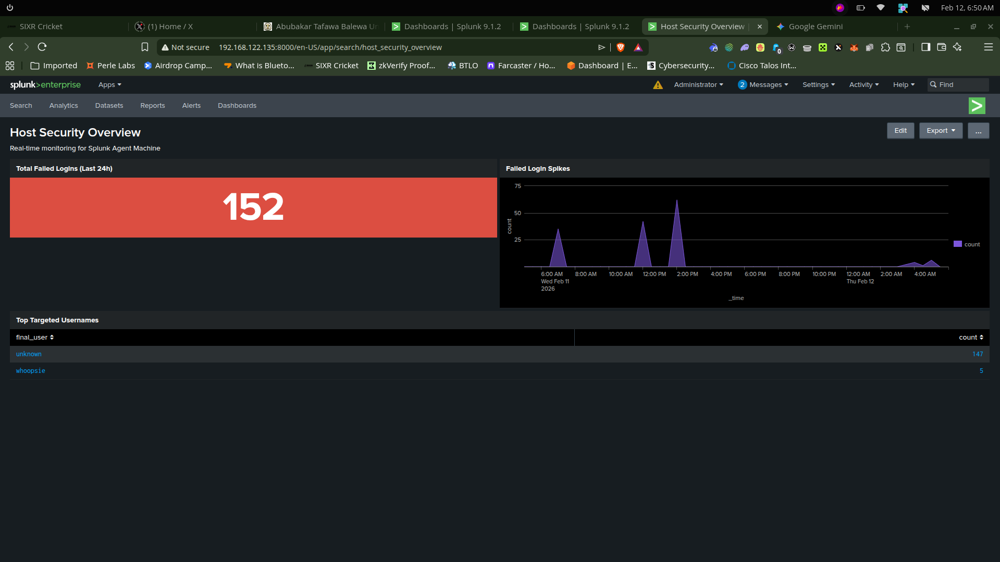

# SIEM Lab: Host Security Monitoring with Splunk

## Overview
This document captures validation and troubleshooting notes for the SOC lab. It describes the end-to-end Splunk pipeline, dashboard creation, attack simulation, and alerting logic.

## Environment
- **Host OS:** Pop!_OS (Ubuntu-based)
- **SIEM VM:** Ubuntu Server running Splunk Enterprise
- **Forwarder:** Splunk Universal Forwarder on monitored hosts
- **Indexer port:** `9997`

## Indexer Preparation
1. Enable receiving on Splunk for port `9997`.
2. Correct permissions if Splunk reports write access errors.

```bash
sudo chown -R socadmin:socadmin /opt/splunk
```

## Universal Forwarder Configuration
If the Splunk admin password is lost, use `user-seed.conf` and restart Splunk to reset it.

```bash
sudo chown -R brandogas:brandogas /opt/splunkforwarder
sudo /opt/splunkforwarder/bin/splunk add monitor /var/log/auth.log
```

- Confirm forwarder ownership and file permissions before starting.
- Verify the forwarder can connect to the indexer on `9997`.

## Failed Login Dashboard
A custom dashboard was created to display authentication failures and forwarder health.

See `docs/setup.md` for the complete XML dashboard definition.



## Attack Simulation
The following command simulates repeated login failures to generate authentication events:

```bash
for i in {1..100}; do
  su - root_hacker_demo -c "exit" 2>/dev/null
 done
```



## Results
- Pipeline validation: `/var/log/auth.log` → Universal Forwarder → Splunk indexer.
- Dashboard showed a spike of 152 failed-authentication events.
- Targeted accounts included `whoopsie` and `root_hacker_demo`.



## Alerting Logic
- **Trigger:** `index=main` search for failed logins.
- **Threshold:** more than 10 failures within 1 minute.
- **Throttling:** 60 seconds.
- **Action:** record the incident in the tracking dashboard.

## Related documentation
- `docs/setup.md` — installation, VM creation, and Splunk deployment steps
- `docs/Architecture.md` — architecture, features, and lab components
